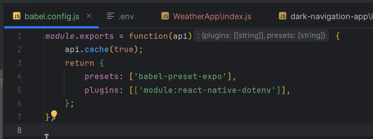

# Weather App using React Native and OpenWeather API

## Project Overview

This project is a simple weather application built using **React Native** with **Expo**. The app fetches real-time weather data from the **OpenWeather API** and displays temperature, humidity, and weather conditions for a user’s current location.

---

## Features

- **Fetch live weather data** using the OpenWeather API.
- **Get user’s current location** using `expo-location` to determine weather conditions.
- **Display weather information** such as temperature, humidity, wind speed, and weather condition.
- **User-friendly UI** with simple styling.
- **Refresh feature** to update weather data.

---

## Prerequisites

### Install Node.js & Expo CLI

Ensure you have **Node.js** installed, then install **Expo CLI**:

```bash
npm install -g expo-cli
```

### Create a New React Native Project

```bash
expo init WeatherApp
cd WeatherApp
```

### Install Required Dependencies

```bash
npm install axios expo-location react-native-elements react-native-vector-icons
```

---

## Getting the OpenWeather API Key

1. Go to [OpenWeather](https://home.openweathermap.org/api_keys).
2. Sign up and get a free API key.
3. Store the API key safely (e.g., in an environment variable or a config file).

---

## Implementation

### 1. Request Location Permission

```javascript
import * as Location from 'expo-location';

const getterLocation = async () => {
  const { status } = await Location.requestForegroundPermissionsAsync();
  if (status !== 'granted') {
    console.log('Permission to access location was denied');
    return;
  }
  const location = await Location.getCurrentPositionAsync({});
  return location;
};
```

### 2. Fetch Weather Data

```javascript
import axios from 'axios';

const API_KEY = 'YOUR_API_KEY';

const getterWeather = async (lat, lon) => {
  try {
    const response = await axios.get(
      `https://api.openweathermap.org/data/2.5/weather?lat=${lat}&lon=${lon}&appid=${API_KEY}&units=metric`
    );
    return response.data;
  } catch (error) {
    console.error('Error fetching weather:', error);
  }
};
```

### 3. Display Weather Data with UI Enhancements

```javascript
import React, {useEffect, useState} from 'react';
import {View, Text, ActivityIndicator, Button, StyleSheet} from 'react-native';
import {Icon} from 'react-native-elements';

const WeatherScreen = () => {
    const [weather, setWeather] = useState(null);
    const [loading, setLoading] = useState(true);

    const fetchWeather = async () => {
        setLoading(true);
        const location = await getterLocation();
        if (location) {
            const data = await getterWeather(location.coords.latitude, location.coords.longitude);
            setWeather(data);
        }
        setLoading(false);
    };

    useEffect(() => {
        fetchWeather();
    }, []);

    if (loading) {
        return <ActivityIndicator size="large" color="#0000ff"/>;
    }

    return (
        <View style={styles.container}>
            <Text style={styles.title}>Weather in {weather.name}</Text>
            <Icon name="cloud" type="font-awesome" size={40} color="#000"/>
            <Text style={styles.info}>Temperature: {weather.main.temp}°C</Text>
            <Text style={styles.info}>Humidity: {weather.main.humidity}%</Text>
            <Text style={styles.info}>Wind Speed: {weather.wind.speed} m/s</Text>
            <Text style={styles.info}>Condition: {weather.weather[0].description}</Text>
            <Button title="Refresh" onPress={fetchWeather}/>
        </View>
    );
};

const styles = StyleSheet.create({
    container: {
        flex: 1,
        justifyContent: 'center',
        alignItems: 'center',
        padding: 20,
    },
    title: {
        fontSize: 24,
        fontWeight: 'bold',
    },
    info: {
        fontSize: 18,
        marginVertical: 5,
    },
});

export default WeatherScreen;
```

---

## Running the App

```bash
expo start
```

Then scan the QR code with the **Expo Go** app on your mobile device.

---

## Future Enhancements

- Add a **search feature** to fetch weather for any city.
- Include **icons** for weather conditions using `react-native-vector-icons`.
- Add **background animations** for different weather conditions.
- Implement **dark mode** support.
- Cache previous weather data to reduce API calls.
- Use `FlatList` to show a **5-day weather forecast**.




```js
module.exports = function(api) {
    api.cache(true);
    return {
        presets: ['babel-preset-expo'],
        plugins: [['module:react-native-dotenv']],
    };
};
```


```json
{
  "name": "weatherapp",
  "license": "0BSD",
  "version": "1.0.0",
  "main": "index.js",
  "scripts": {
    "start": "expo start",
    "android": "expo start --android",
    "ios": "expo start --ios",
    "web": "expo start --web"
  },
  "dependencies": {
    "axios": "^1.8.1",
    "dotenv": "^16.4.7",
    "expo": "~52.0.37",
    "expo-location": "^18.0.7",
    "expo-status-bar": "~2.0.1",
    "react": "18.3.1",
    "react-native": "0.76.7",
    "react-native-dotenv": "^3.4.11",
    "react-native-elements": "^3.4.3",
    "react-native-vector-icons": "^10.2.0"
  },
  "devDependencies": {
    "@babel/core": "^7.20.0"
  },
  "private": true
} 
```